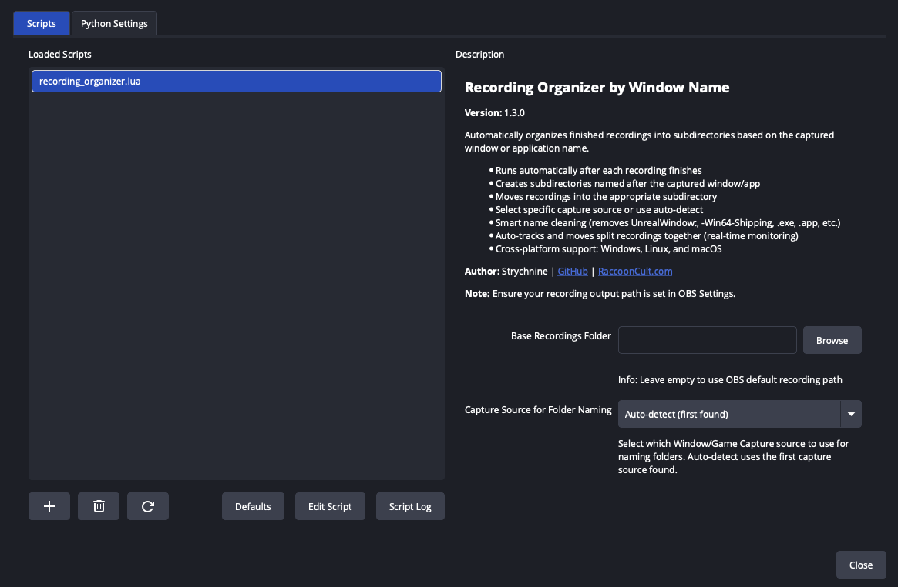

# Recording Organizer

Automatically organizes your OBS Studio recordings into subdirectories based on the captured window or application name.



**Zero setup required** - Just load the script and start recording!

---

## 🚀 Quick Start (30 seconds)

1. **Download** `recording_organizer.lua`
2. **Open OBS** → `Tools` → `Scripts`
3. **Click `+`** (Add Scripts)
4. **Select** the `.lua` file
5. **Done!** Your recordings are now automatically organized

---

## ✨ Features

- ✅ **Automatic Organization** - Runs after each recording finishes
- ✅ **Smart Window Detection** - Extracts clean game/app names from capture sources
- ✅ **Source Selection** - Choose specific capture source or use auto-detect
- ✅ **Clean Folder Names** - Removes junk like `UnrealWindow:`, `-Win64-Shipping.exe`, underscores
- ✅ **Multi-Platform** - Works on Windows, Linux, and macOS
- ✅ **Zero Dependencies** - Lua is built into OBS

## 📋 Requirements

- **OBS Studio** 27.0 or higher
- That's it! No Python, no external dependencies

## ⚙️ Configuration

Once loaded, configure in the script properties:

- **Base Recordings Folder** - Custom folder path (leave empty to use OBS default)
- **Capture Source** - Choose which source to use for folder naming:
  - **Auto-detect** - Uses first Window/Game Capture found (default)
  - **Specific Source** - Pick from your Window/Game Capture sources

### Verify It's Working

1. Make a short test recording
2. Stop recording
3. Check the **Script Log** button - look for `"Successfully moved recording"`
4. Your recording should be in a subdirectory named after your game/window

## 📂 How It Works

When a recording stops:
1. Script detects your Window/Game Capture source
2. Extracts the window/game name
3. Cleans up the name (removes `.exe`, `UnrealWindow:`, `-Win64-Shipping`, etc.)
4. Creates a folder with that name
5. Moves the recording into the folder

### Example Folder Structure

```
📁 Recordings/
├── 📁 HellIsUs/
│   ├── 2025-10-05_16-30-45.mkv
│   └── 2025-10-05_17-15-22.mkv
├── 📁 Google Chrome/
│   └── 2025-10-05_18-00-10.mkv
└── 📁 Unknown/    ← If no capture source detected
    └── 2025-10-05_20-00-00.mkv
```

## 🎯 Supported Capture Types

- ✅ **Window Capture** (Windows)
- ✅ **Game Capture** (Windows)  
- ✅ **XComposite** (Linux)
- ✅ **macOS Screen Capture** (macOS)

### macOS Screen Capture Setup (Important!)

For macOS Screen Capture to work properly:

1. Add a **macOS Screen Capture** source to your scene
2. In source settings, set **Method** to **"Application"** (not Window or Display)
3. Select the specific application you want to capture
4. The script will extract the app name (e.g., "Chrome", "Blender", "Safari")

**Alternative:** Rename your Screen Capture source to match what you're recording (e.g., "Blender Project") and the script will use that name.

**Note:** Display Capture mode is not supported (doesn't provide window/app names)

## 🔧 Troubleshooting

### Recordings Go to "Unknown" Folder

**Causes:**
- Using Display Capture (not supported)
- No Window/Game Capture source in scene
- Game Capture in "any fullscreen" mode without window selection
- **macOS:** Screen Capture set to "Display" or "Window" mode instead of "Application"

**Solutions:**
1. **Windows/Linux:** Use **Window Capture** or **Game Capture** sources
2. **macOS:** Set Screen Capture method to **"Application"** and select an app
3. **Alternative (macOS):** Rename your Screen Capture source to match what you're recording
4. Manually select your capture source in script settings dropdown
5. Check **Script Log** to see what's being detected
6. For Game Capture, try "Capture specific window" mode

### Script Not Loading

- Check **Script Log** for error messages
- Ensure you selected `recording_organizer.lua`
- Reload script with 🔄 refresh button

### Recordings Aren't Moving

- Check file permissions (try running OBS as administrator)
- Check **Script Log** for errors
- Verify base folder path exists

### Dropdown is Empty

- **Windows/Linux:** Add a Window Capture or Game Capture source to any scene
- **macOS:** Add a macOS Screen Capture source to any scene
- Click 🔄 refresh button in Scripts window

---

## 🎨 Customization

Edit `obs_recording_organizer.lua` to customize:
- **`sanitize_folder_name()`** - Change folder name cleaning rules
- **`find_capture_source_name()`** - Add support for more source types
- **`organize_recording()`** - Modify folder structure

---

## 📜 License

MIT License - Free to use, modify, and distribute

---

## 👤 Author

**Strychnine**  
GitHub: [@rabbitcannon](https://github.com/rabbitcannon)  
Website: [RaccoonCult.com](https://raccooncult.com)

---

## 💬 Support

If you find this useful:
- ⭐ Star the repository
- 🐛 Report issues on GitHub
- 💡 Suggest features

---

**Made with ❤️ for the OBS community**
